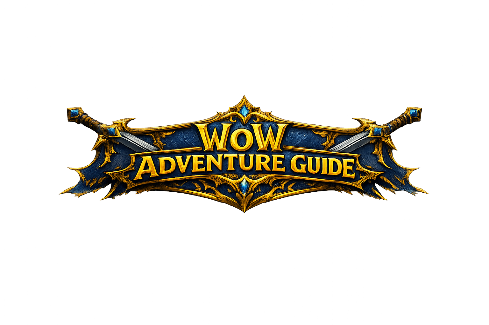

# Angular Seminario 2026
<p align="center">
  
</p>


<p align="center">
  
  
  
  
</p>

---
- **Nombre y apellido:** Lemma Ignacio
- **DNI:** 46188729
- **Correo electrónico:** ilemma@alumnos.exa.unicen.edu.ar
- **Sede:** Tandil

---
## Descripción del proyecto

**WoW Adventure Guide** es una aplicación Angular para la guía para jugadores de World of Warcraft.

La aplicación explora las clases disponibles, conocer sus roles y especializaciones, consultar información sobre mazmorras y construir una composición de party válida.

Una party está formada por cinco integrantes y una composición valida:

- 1 Tanque
- 1 Sanador
- 3 DPS

Se seleccionar una mazmorra, elegir la clase y especialización de cada integrante y guardar la composición mediante una API externa.

> [!NOTE]
> Los datos de las clases y las paryus se administran mediante MockAPI.

### Guía de clases

Muestra las clases del WoW mediante una API

Para cada clase se trae:

- Nombre
- Descripción
- Roles disponibles
- Especializaciones
- Tipo de armadura
- Imagen representativa

### Guía de mazmorras

Muestra información sobre distintas mazmorras:

- Nombre
- Dificultad
- Ubicación
- Descripción
- Clases recomendadas

### Constructor de party

Permite:

- Seleccionar una mazmorra
- Elegir cinco clases
- Seleccionar una especialización para cada clase
- Determinar automáticamente el rol de cada especialización
- Validar la composición del grupo
- Guardar una party válida mediante una solicitud HTTP POST
- Mostrar un resumen de la party guardada

---
### 1. Ruteo
| Ruta | Componente |
|---|---|
| `/` | `Home` |
| `/classes` | `Classes` |
| `/dungeons` | `Dungeons` |
| `/recommender` | `Recommender` |

### 2. Componentes

La página Recommender contiene dos componentes diferentes:

```html
<app-party-builder></app-party-builder>
<app-party-summary></app-party-summary>
```

**Archivos:**

```text
src/app/pages/recommender/recommender.html
src/app/components/party-builder/
src/app/components/party-summary/
```

### 3. Interfaces

**Interfaces implementadas:**

```text
src/app/interfaces/wow-class.ts
src/app/interfaces/specialization.ts
src/app/interfaces/dungeon.ts
```

### 4. Control de flujo

Se utilizarpm estructuras de control "modernas" de Angular:

- @for
- @if

Ejemplo  `@for`:

```html
@for (wowClass of wowClasses(); track wowClass.id) {
  <app-class-card [wowClass]="wowClass"></app-class-card>
}
```

Ejemplo  `@if`:

```html
@if (wowClass.roles.length > 1) {
  <span class="badge text-bg-success">
    Clase versátil
  </span>
} @else {
  <span class="badge text-bg-info">
    Clase especializada
  </span>
}
```

**Archivos:**

```text
src/app/components/class-list/class-list.html
src/app/components/class-card/class-card.html
src/app/components/party-builder/party-builder.html
src/app/components/party-summary/party-summary.html
```

### 5. Comunicación entre componentes

La comunicación se realiza mediante @Output y @Input

El componente PartyBuilder emite una party guardada:

```ts
@Output() formSubmitted = new EventEmitter();
```

```ts
this.formSubmitted.emit(party);
```

Recommender recibe el evento:

```html
<app-party-builder
  (formSubmitted)="onPartySubmitted($event)"
></app-party-builder>
```

Envía los datos a PartySummary:

```html
<app-party-summary
  [party]="submittedParty"
></app-party-summary>
```

El flujo se ve como:

```text
PartyBuilder
    |
    | @Output
    v
Recommender
    |
    | @Input
    v
PartySummary
```

---
### Solicitud GET

El servicio WowClassData obtiene las clases:

```ts
getClasses(): Observable<WowClass[]> {
  return this.http.get<WowClass[]>(API_URL);
}
```

El componente ClassList se suscribe al resultado:

```ts
this.wowClassData.getClasses().subscribe(classes => this.wowClasses.set(classes));
```

---

### Solicitud POST

El servicio PartyData guarda composición válida:

```ts
createParty(party: unknown): Observable<unknown> {
  return this.http.post(API_URL, party);
}
```

El formulario realiza el POST únicamente cuando es válido:

```ts
if (this.partyForm.valid) {
  const party = this.partyForm.getRawValue();

  this.partyData.createParty(party).subscribe(() => {
    this.formSubmitted.emit(party);
  });
}
```
## Formulario reactivo

El constructor de partys fue implementado utilizando:

- ReactiveFormsModule
- FormGroup
- FormControl
- Validators.required
- Validador independiente

El formulario tiene:

```text
partyForm
├── dungeon
├── member1
├── member2
├── member3
├── member4
└── member5
```

Cada miembro tiene:

```text
wowClass
specialization
```

El validador comprueba que la party tenga:

```text
1 Tanque
1 Sanador
3 DPS
```

Sino cumple la condicion, muestra un error:

```ts
return {
  invalidComposition: true
};
```

El botón permanece deshabilitado mientras el formulario sea inválido:

```html
<button
  type="submit"
  [disabled]="partyForm.invalid"
>
  Crear composición
</button>
```

---

### Documentación 

- [Angular: Components](https://angular.dev/guide/components)
- [Angular: Routing](https://angular.dev/guide/routing)
- [Angular: Control Flow](https://angular.dev/guide/templates/control-flow)
- [Angular: Input properties](https://angular.dev/guide/components/inputs)
- [Angular: Output events](https://angular.dev/guide/components/outputs)
- [Angular: Dependency Injection](https://angular.dev/guide/di)
- [Angular: HttpClient](https://angular.dev/guide/http)
- [Angular: Configuración de HttpClient](https://angular.dev/guide/http/setup)
- [Angular: Making HTTP requests](https://angular.dev/guide/http/making-requests)
- [Angular: Forms](https://angular.dev/guide/forms)
- [Angular: Reactive Forms](https://angular.dev/guide/forms/reactive-forms)
- [Angular: ReactiveFormsModule](https://angular.dev/api/forms/ReactiveFormsModule)
- [Angular: Zoneless](https://angular.dev/guide/zoneless)
- [Angular v18: provideExperimentalZonelessChangeDetection](https://v18.angular.dev/api/core/provideExperimentalZonelessChangeDetection)
- [Angular Blog: Announcing Angular v20](https://blog.angular.dev/announcing-angular-v20-b5c9c06cf301)

### Fuentes

- [TypeScript Handbook](https://www.typescriptlang.org/docs/handbook/intro.html)
- [Bootstrap 5.3](https://getbootstrap.com/docs/5.3/getting-started/introduction/)
- [Bootstrap Navbar](https://getbootstrap.com/docs/5.3/components/navbar/)
- [Bootstrap Cards](https://getbootstrap.com/docs/5.3/components/card/)
- [MockAPI](https://mockapi.io/)
- [Zoneless.com: Documentation](https://zoneless.com/docs)

### Artículos

- [Reddit: Zoneless benefits](https://www.reddit.com/r/angular/comments/1mvsap8/zoneless_benefits/)
- [DEV Community: Angular 20 y el futuro sin Zone.js](https://dev.to/ricardochl/angular-20-y-el-futuro-sin-zonejs-la-revolucion-zoneless-ha-llegado-a-developer-preview-4k5m)
- [Medium: Angular beyond Zone.js](https://medium.com/@prashantsaransingh/angular-beyond-zone-js-a-complete-guide-to-zoneless-and-standalone-architecture-eda1f520e71e)
